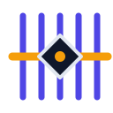

<div align="center">

<p align="center">
  
</p>

<h1>Looming: Enterprise Agent Engineering in One Self-Contained Bundle</h1>

<p>
One install gives an organization the whole agent lifecycle: a governed
model gateway, pluggable agent runtimes, organization-wide memory and a
unified tools/MCP/skills registry, isolated sandbox execution, and
issue-driven development pipelines across GitHub and self-hosted GitLab CE.
</p>

<p align="center">
  <a href="https://github.com/kikakkz/looming/actions/workflows/ci.yml?branch=main"></a>
  
  <a href="#license"></a>
</p>

<p align="center">
  <strong>
    <a href="#why-looming">Why Looming</a> ·
    <a href="#architecture">Architecture</a> ·
    <a href="#status">Status</a> ·
    <a href="#security">Security</a> ·
    <a href="#compared-with-other-tools">Compared</a> ·
    <a href="#documentation">Docs</a> ·
    <a href="#contributing">Contributing</a>
  </strong>
</p>

</div>

---

> Bootstrap: repository conventions, CI gates, and the architecture record
> (AD-1 … AD-18) are in place. Components are built issue by issue; the
> model gateway is the first component and starts with its own issue.

---

## Table of Contents

- [Why Looming?](#why-looming)
- [Architecture](#architecture)
- [Status](#status)
- [How Looming Works](#how-looming-works)
- [Security](#security)
- [Compared With Other Tools](#compared-with-other-tools)
- [Documentation](#documentation)
- [Contributing](#contributing)
- [License](#license)

---

## Why Looming?

Coding agents have won. Claude Code, Codex, Kimi, and their kin now write a
large share of real production code — but every organization is left to
assemble the same surrounding machinery by hand:

- a gateway with auth, quota, and audit between developers and model APIs
- isolated, disposable execution environments for unattended agents
- organizational memory that outlives any single session or employee
- a curated, scanned registry of tools, MCP servers, and skills
- pipelines where agents pick up real issues and deliver reviewable MRs

Stripe, Shopify, Spotify, and Coinbase each spent years building this glue
in-house. Looming productizes it: the same patterns, installable as one
bundle, governable as one control plane.

Looming adds the missing organization layer underneath the agents you
already use:

| Concern | What Looming provides |
|---|---|
| Model access | Stateless OpenAI-compatible gateway: API keys (enterprise SSO later), per-user quota, append-only interaction log, pluggable risk interception |
| Agent runtime | Provider system with capability levels L0–L3; bundle a default or bring your own Codex, Kimi Code, goose, and others |
| Knowledge | Unified memory (org/project/user scopes, review-gated writes) plus a unified registry for MCP servers, skills, and tools |
| Execution | Elastic sandbox pool (Kubernetes + gVisor, warm pool): no production credentials, no egress except allowlist, disposable per run |
| Workflows | Issue-driven development across GitHub and bundled GitLab CE: agents take issues, plans land in the issue thread, MRs pass the same CI gates as humans |
| Quality | Verifier-first: CI guards known failures deterministically; the judge discovers new failures and promotes them into checks, memory, and tooling |

The goal is not to become another coding agent. Looming is the
infrastructure an organization runs *underneath* whichever agents its
developers prefer.

---

## Architecture

**Batteries included, everything swappable.** Every major component is a
slot behind a small versioned interface; the bundle ships the combination
we consider best, and each slot can be replaced with your own or an
open-source alternative.

```text
┌─────────────────────────── Looming bundle ────────────────────────────┐
│                                                                         │
│  Control plane (product core, not pluggable)                            │
│  ┌─────────────────────────────────────────────────────────────────┐   │
│  │ blueprint orchestrator · event log · issue protocol · judge      │   │
│  └─────────────────────────────────────────────────────────────────┘   │
│                                                                         │
│  Pluggable slots (default in bundle ▸ alternatives)                     │
│  ┌────────────┐ ┌────────────┐ ┌────────────┐ ┌──────────────────────┐  │
│  │ gateway    │ │ runtime    │ │ memory     │ │ registry             │  │
│  │ Go gateway │ ▸ providers  │ ▸ mem0 /     │ │ ToolHive ▸           │  │
│  │ ▸agentgw?  │  (L0–L3)     │  Graphiti…   │ │ mcp-context-forge    │  │
│  └────────────┘ └────────────┘ └────────────┘ └──────────────────────┘  │
│  ┌────────────┐ ┌────────────┐ ┌────────────┐                          │
│  │ sandbox    │ │ SCM        │ │ decision   │                          │
│  │ K8s+gVisor │ │ GitLab CE  │ │ engine     │                          │
│  │ ▸E2B/Kata  │ │ +GitHub    │ │ rules+Laya │                          │
│  └────────────┘ └────────────┘ └────────────┘                          │
└─────────────────────────────────────────────────────────────────────────┘
```

The control plane — blueprint orchestration, the append-only event log,
and the issue protocol — is deliberately *not* pluggable: it is the
product. Everything else is a swappable component with a conformance
contract.

---

## Status

In place:

- Repository operating contract ([AGENTS.md](AGENTS.md)) and CI gate
  (`make ci-gate`: lockfile validation, tool tests, trailer policy)
- Issue-driven process: kind/area taxonomy (Kubernetes convention),
  templates, DCO + AI attribution policy
- Agent asset directory (`.ai/`): sha-pinned external skills, repo skills,
  memory bank with accepted decisions AD-1 … AD-18

Decided, being built:

- Model gateway (Go) — first component, issue-tracked
- Runtime bake-off spike (opencode / OpenHands smoke, then full spike)
- Event-stream schema — its own design issue

Planned slots (see [decisions](.ai/memory/decisions.md)):

- ToolHive-based registry, sandbox pool operator, GitLab CE adapter,
  decision-engine integration, bundle topology wizard

---

## How Looming Works

The authoritative record of the architecture is
[.ai/memory/decisions.md](.ai/memory/decisions.md): 18 accepted decisions
covering the gateway, sandbox and credential model, runtime provider
system, memory governance, registry, and quality gate. Long-form documents
land in [docs/](docs/) through the same issue-driven process.

In one paragraph: issues are the work surface; agents run in isolated
sandboxes with per-run, short-lived, repo-scoped credentials; model calls
route through the gateway so quota, audit, and risk interception apply
uniformly; outputs leave the sandbox only as merge requests that pass the
same deterministic CI as human work; a judge reviews every MR, and what it
learns is promoted into CI checks, memory, and tooling.

---

## Security

- Sandboxes are disposable and deny-by-default: no production credentials,
  no network egress except an allowlist (SCM hosts and package registries).
- Credentials are minted per run, scoped to a single repository, and never
  enter logs; requests carrying credentials outside their allowed channel
  are rejected before forwarding.
- External skills and MCP servers are sha-pinned and license-checked in CI;
  MCP servers additionally require an admission security scan.
- AI contributions are disclosed with `Assisted-by:` / `Generated-by:`
  trailers; a human signs DCO and takes responsibility for every merge.

---

## Compared With Other Tools

| Tool | What it is | Where Looming differs |
|---|---|---|
| LiteLLM / one-api | Model gateway and proxy | Looming keeps the gateway and adds the organization layer around it: sandboxes, memory, registry, issue-driven pipelines |
| Dify / Coze | Agent application platforms | Looming is infrastructure you run yourself — SCM-native, issue-native, no hosted SaaS dependency |
| Devin / coding-agent products | A specific agent you adopt | Looming orchestrates whichever agents you already use, behind one governance plane |
| GitHub / GitLab | Code hosting and CI | Looming is the agent control plane that works across both, keeping repo CI native while running its own pipeline |

---

## Documentation

- [AGENTS.md](AGENTS.md) — operating contract for humans and AI agents
- [CONTRIBUTING.md](.github/CONTRIBUTING.md) — DCO, AI contribution policy, dev setup
- [.ai/memory/decisions.md](.ai/memory/decisions.md) — accepted architecture decisions
- [docs/](docs/) — long-form design documents (land via issues)

---

## Contributing

Every change starts as an issue, lands as a PR with its own CI, and —
for humans — carries a DCO sign-off. AI assistance is welcome and must be
disclosed with trailers. See [CONTRIBUTING.md](.github/CONTRIBUTING.md).

## Topics

`agent-engineering` `ai-agents` `model-gateway` `sandbox` `mcp` `agent-skills`
`issue-driven-development` `gitlab-ce` `kubernetes` `enterprise`

## License

[Apache-2.0](LICENSE)
