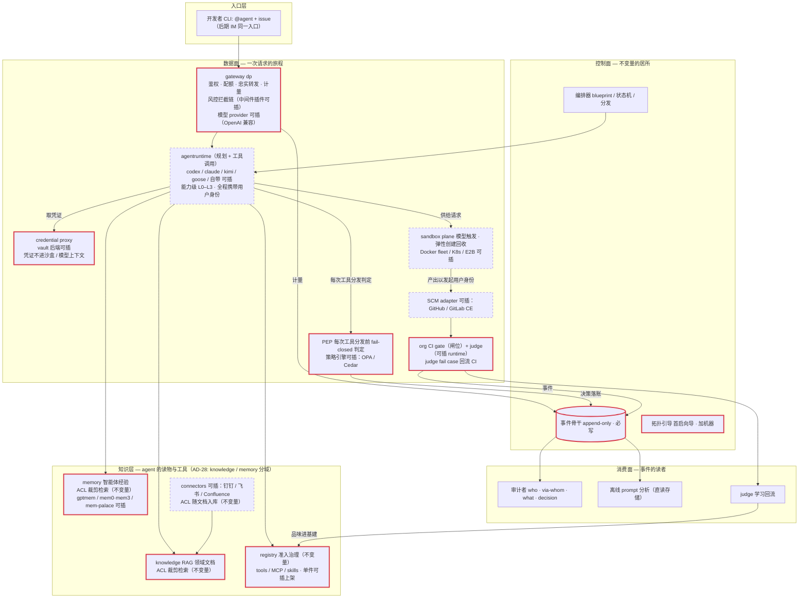
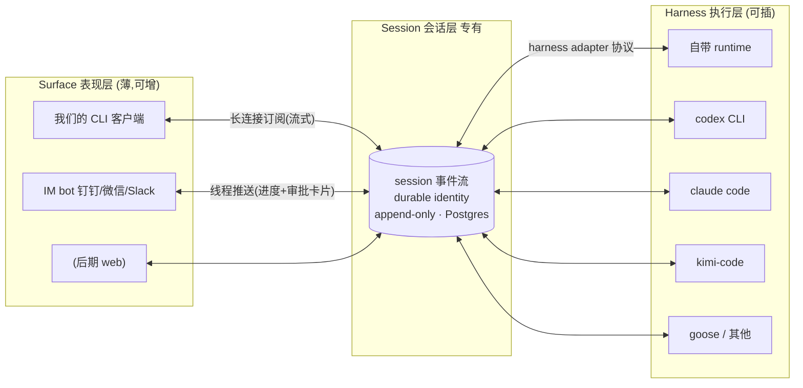
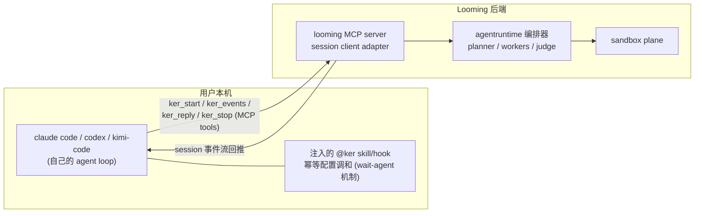
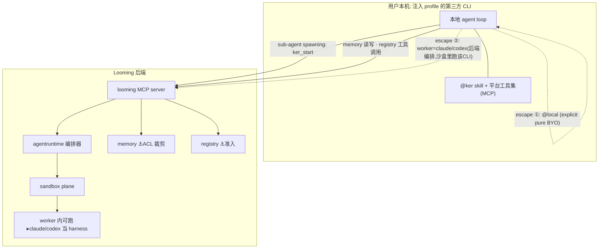

# Architecture overview

The readable companion to the decision records. Facts live in
[AD-27](../../.ai/memory/decisions/0027-product-architecture-v0-2-components-invariants.md)
(components and invariants), [AD-28](../../.ai/memory/decisions/0028-product-domain-context-map-v1.md)
(domain context map), and [AD-29](../../.ai/memory/decisions/0029-gateway-thin-slot-host.md)
(gateway slot shape); the normative vocabulary is in
[glossary.md](glossary.md). Solidified from #66 (closed) — the
diagrams below render the same v0.2 map the decisions narrate.

## One-paragraph shape

Looming is an enterprise agent-engineering platform shipped as one
bundle. A thin slot-hosting **gateway** fronts model traffic with
authn, quota enforcement, a pluggable interception chain, and
faithful forwarding. **Sessions** (durable identity plus an
append-only event stream) are the proprietary core; every surface
(CLI, later IM) is a renderer and every harness (our runtime, or
codex/claude/kimi-code/goose in sandboxes) is an adapter against the
session protocol. **Orchestration** dispatches planner/executor/
worker/judge roles into **model-triggered sandboxes**. **Knowledge**
(RAG over org documents), **Memory** (review-gated experience), and
**Registry** (admission governance for tools/MCP/skills/policy rules)
are three separate contexts. The append-only metering records,
interaction bodies, and audit decision events are owned by the
**Records/observability** context (the Session context separately
owns its runtime event stream, AD-27 §3). SCM integration and CI
orchestration connect the organization's existing engineering estate.

## Data plane — one request's journey

Solid boxes are invariants (never pluggable); dashed boxes are slots
(implementation-swappable behind small contracts, AD-27 §2).

## Surface / Session / Harness layering

Surfaces are thin and addable; the session layer is proprietary; the
harness layer is a set of adapters:

## Third-party agent CLIs: dual mode

Third-party CLIs integrate as surfaces via MCP — not by forking them.
Two modes, one default:

With the injected profile, memory and registry tools are the
platform's (approved tools only, hidden pre-model), and the routing
invariant holds mechanically:

**The routing invariant is one line: sub-agent ⇒ ker.** The local
spawn tool is hidden, so `ker_start` is the only door. Escapes are
explicit: `@local` (pure BYO, out of platform audit) and
`worker=claude|codex` (backend orchestration with that CLI executing
inside the worker sandbox).

## Reading order

1. [context-map.md](context-map.md) — the eleven bounded contexts
2. [glossary.md](glossary.md) — normative terms
3. `docs/component-patterns.md` — the four binding engineering patterns
4. The AD records — why each shape is what it is
